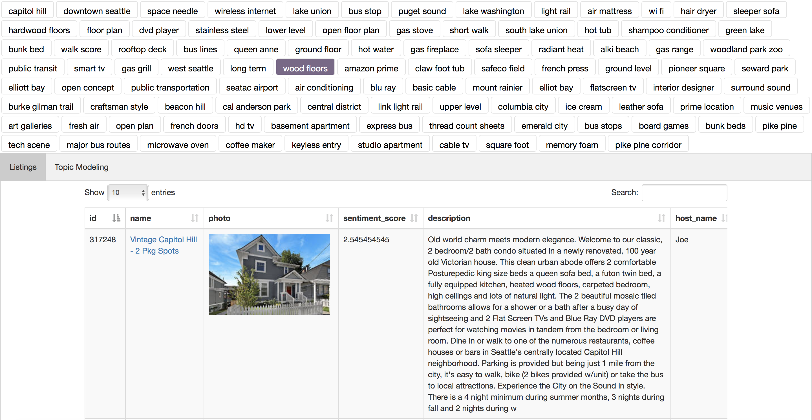
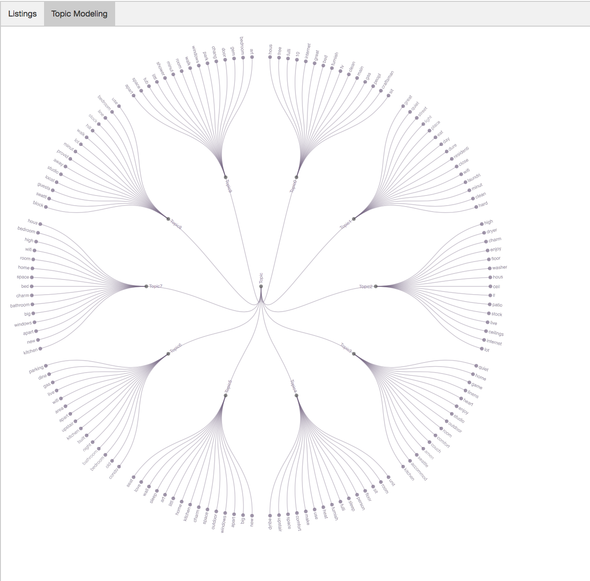

# Airbnb Search System With Text Mining

## Overview
This app implements topic modeling, frequent phrase mining and sentiment analysis
on airbnb listings and reviews data to allow user to search hotel easier by filtering the listings by key words extracted from the listing descriptions, order the listings by reviews' sentiment score.
Also, topic modeling is implemented to allow user to discover the topics of
listings descriptions. This system is delivered as a web page. A small set of listings data is used to build the web page.

## Data

The system is built on a small set of airbnb hotel data. The data is downloaded from
[Kaggle](https://www.kaggle.com/airbnb/seattle). This dataset contains of 3818 house postings in Seattle WA and 84849 reviews data.
Each house has text data on summary, space, description, neighborhood overview, notes and transit.

## Technologies Used in this application
##### 1. Frequent Phrase mining
This is done using [SegPhrase](https://github.com/shangjingbo1226/SegPhrase) mining technology. SegPhrase mines phrase with tiny set of training data.
The essential idea is to feed a small set of training data into mining process. In this project, I produced a training list of phrases and feed it into the algorithm to get a list of frequent phrase.
##### 2. Topic Modeling
This project uses LDA algorithm to conduct topic modeling on the listings description data. The text data is preprocessed with the following steps: stemming, removing stop words, eliminating words that have document frequency smaller than 0.1 and bigger than 0.9 removed. For each subset of the listings (filtered by the frequent phrase), ten topics are generated, each of which is represented by 15 words. 

##### 3. Sentiment analysis
This project uses the [Stanford Sentiment Analysis tool](https://d396qusza40orc.cloudfront.net/dataminingcapstone/Tasks4and5/sentimentAnalysis.jar) to conduct
sentiment analysis on the reviews data for each listing is used to conduct SentimentAnalysis.
The output sentiment score is from 1-5, with 1 means very negative and 5 means very positive. The score of a house is the average of all the reviews under this house posting. 

## How to use
The website can be access [here](https://hcxyeah.github.io/MCS-BetterSearchHotel/). There are three parts of the web page: frequent phrases tags, airbnb listings, and topic modeling
result.

Here are some steps of how to use the web page:
1. Select a phrase out of the frequent phrases list.

2. A table of airbnb listings will show up on Listing tab. When browsing the listings, user can re-order the list by sentiment score by clicking on the sentiment_score header to look at the most positive/negative result.
3. On Topic tab is the visualization of the topic modeling on the filtered airbnb listings description text data. User can re-select the phrase tag to update the topic graph. Mouse hover over the topic will highlight the topic.

## Limitation
The webpage is a very simplified version as it's just a place to dilever the analysis result and ideas. The key part
of this project is the analysis on the text data and the web page is just micmic the real world scenario. The data used in this project is a small set. In real world as
the data scales, the efficiency of the analysis may reduce.
